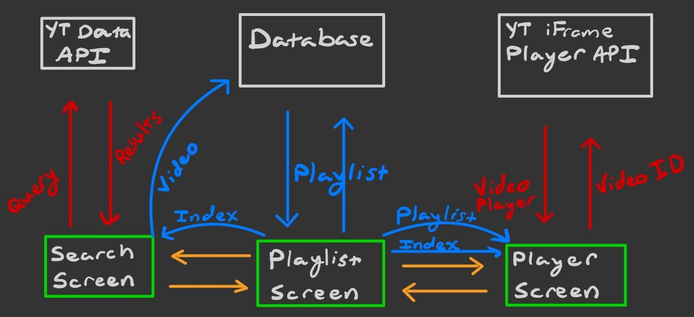

# SharkJam

SharkJam is a cross-platform mobile app made using Flutter that provides an easy interface for
gathered friends to build a playlist that everyone will enjoy. Just fire up
SharkJam and pass around the phone to let everyone add their favorite songs,
and you'll have a mutually agreeable playlist in no time.

---

## Installation Instructions for Developers

 - Install VSCode (or preferred IDE)
 [[macOS](https://code.visualstudio.com/docs/setup/mac)]
 [[Linux](https://code.visualstudio.com/docs/setup/linux)]
 [[Windows](https://code.visualstudio.com/docs/setup/windows)]
    - In our experience VSCode is very easy to work with for flutter development, but other major IDEs, such as IntelliJ IDEA will work as well.

 - Install Flutter
 [[macOS](https://flutter.dev/docs/get-started/install/macos)]
 [[Linux](https://flutter.dev/docs/get-started/install/linux)]
 [[Windows](https://flutter.dev/docs/get-started/install/windows)]
    - Ensure you install either the iOS or Android Simulators in order to be able to run the code.

- Install Flutter and Dart Plugins for your IDE
    - [[VSCode](https://flutter.dev/docs/development/tools/vs-code)]
    - [[IntelliJ IDEA](https://flutter.dev/docs/development/tools/android-studio)] 

- Clone this Repo to your local machine
    ```
    git clone https://github.com/carterjswift/sharkjam
    ```

- Create a `.env` file in your `sharkjam` directory and paste in a Youtube Data API key
    - You can get an API key on the [Google API Console](https://console.developers.google.com)
    - Syntax for `.env `:
        `KEY=Paste_API_key_here`
---

## System Architecture

Below is a diagram of how the main components of the app interact with eachother.
Red arrows represent operations that require network connectivity, blue
arrows represent flow of data, and orange arrows represent UI relationships.




## How to Run the Application

With all of the installation steps done, the app can be run from VSCode by
clicking Run then "Start Debugging".

## Common Issues

- Performing many searches on the app will cause the API call quota to be reached.
The only way around this currently is to wait for the next day or generate a
new API key.

- If you get errors relating to import statements, it's likely that not all
necessary packages were installed. Running `flutter pub get` should resolve
this.

### Clearing the Database

To clear the database, uncomment line 18 in `database_provider.dart` and refresh
the application.

## Known Bugs

After conducting usability tests with 9 participants, some bugs are found.

### Bug#1

The user needs to press Enter / Search twice to get the desired search result.

#### Cause

The search result screen is created before the API finishes loading all the search results ➡︎ Empty screen.

#### Solution 

Make the buildResult await retrieving the search result.
